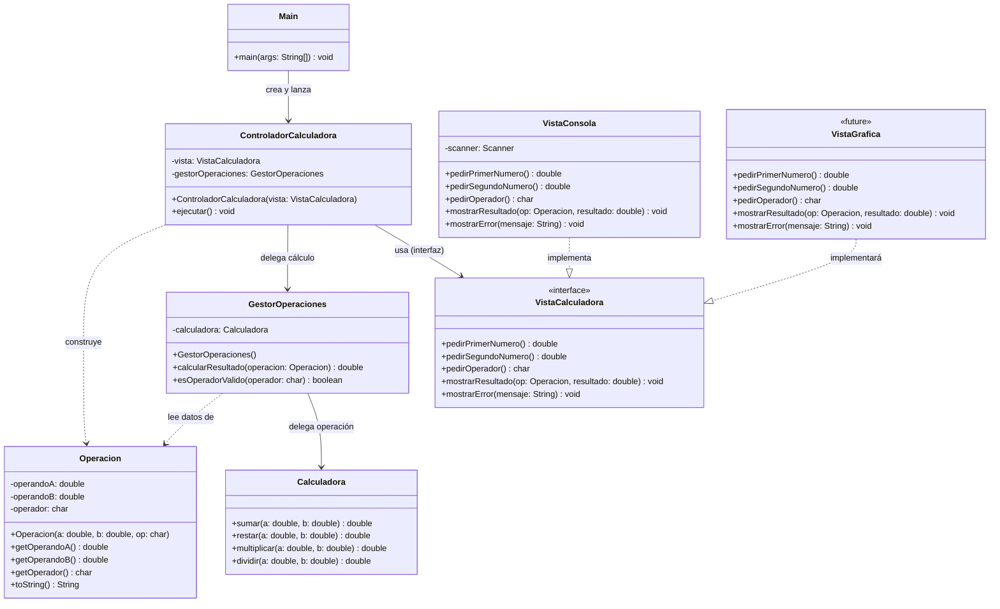
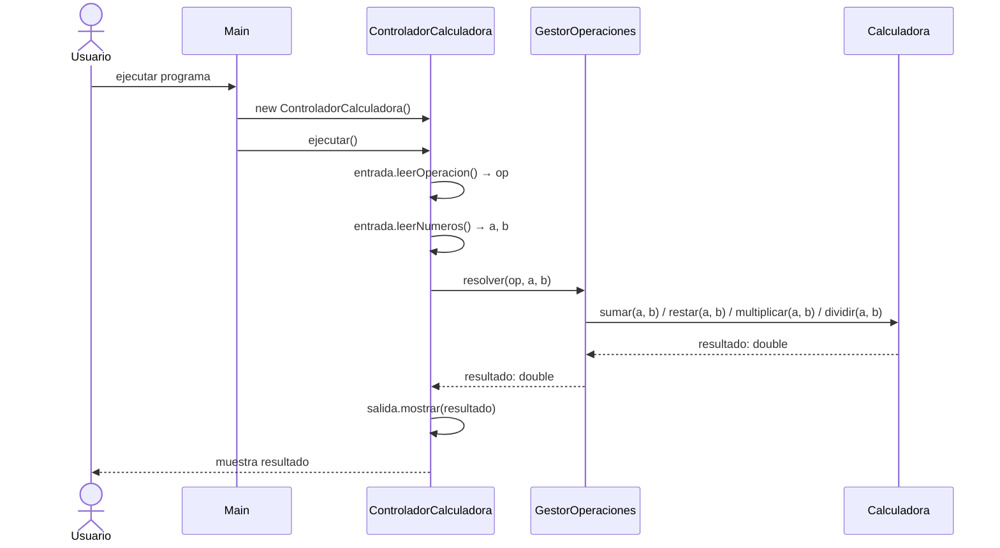
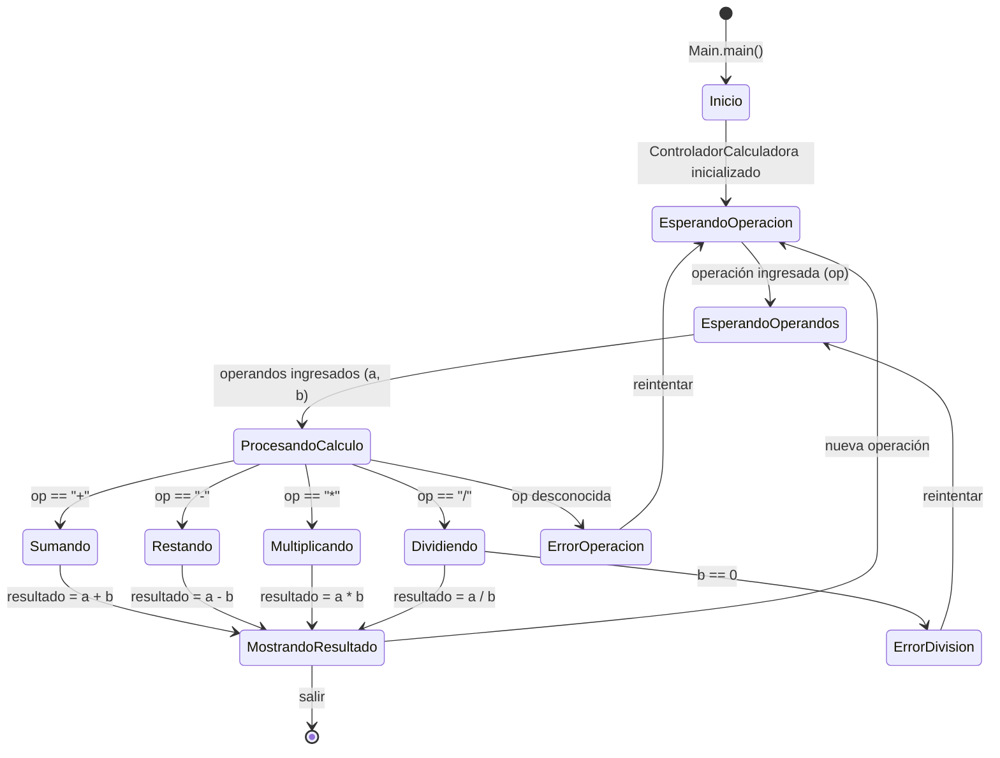

# UML_y_Markdown

```mermaid
classDiagram
    direction TB

    %% ─────────────── PUNTO DE ENTRADA ───────────────
    class Main {
        +main(args: String[]) void
    }

    %% ─────────────── CONTROLADOR ───────────────
    class ControladorCalculadora {
        -vista: VistaCalculadora
        -gestorOperaciones: GestorOperaciones
        +ControladorCalculadora(vista: VistaCalculadora)
        +ejecutar() void
    }

    %% ─────────────── LÓGICA ───────────────
    class GestorOperaciones {
        -calculadora: Calculadora
        +GestorOperaciones()
        +calcularResultado(operacion: Operacion) double
        +esOperadorValido(operador: char) boolean
    }

    %% ─────────────── MODELO ───────────────
    class Calculadora {
        +sumar(a: double, b: double) double
        +restar(a: double, b: double) double
        +multiplicar(a: double, b: double) double
        +dividir(a: double, b: double) double
    }

    class Operacion {
        -operandoA: double
        -operandoB: double
        -operador: char
        +Operacion(a: double, b: double, op: char)
        +getOperandoA() double
        +getOperandoB() double
        +getOperador() char
        +toString() String
    }

    %% ─────────────── VISTA ───────────────
    class VistaCalculadora {
        <<interface>>
        +pedirPrimerNumero() double
        +pedirSegundoNumero() double
        +pedirOperador() char
        +mostrarResultado(op: Operacion, resultado: double) void
        +mostrarError(mensaje: String) void
    }

    class VistaConsola {
        -scanner: Scanner
        +pedirPrimerNumero() double
        +pedirSegundoNumero() double
        +pedirOperador() char
        +mostrarResultado(op: Operacion, resultado: double) void
        +mostrarError(mensaje: String) void
    }

    class VistaGrafica {
        <<future>>
        +pedirPrimerNumero() double
        +pedirSegundoNumero() double
        +pedirOperador() char
        +mostrarResultado(op: Operacion, resultado: double) void
        +mostrarError(mensaje: String) void
    }

    %% ─────────────── RELACIONES ───────────────
    Main --> ControladorCalculadora : crea y lanza

    ControladorCalculadora --> VistaCalculadora : usa (interfaz)
    ControladorCalculadora --> GestorOperaciones : delega cálculo
    ControladorCalculadora ..> Operacion : construye

    GestorOperaciones --> Calculadora : delega operación
    GestorOperaciones ..> Operacion : lee datos de

    VistaConsola ..|> VistaCalculadora : implementa
    VistaGrafica ..|> VistaCalculadora : implementará
```

```mermaid
sequenceDiagram
    actor Usuario
    participant Main
    participant ControladorCalculadora
    participant GestorOperaciones
    participant Calculadora

    Usuario->>Main: ejecutar programa
    Main->>ControladorCalculadora: new ControladorCalculadora()
    Main->>ControladorCalculadora: ejecutar()

    ControladorCalculadora->>ControladorCalculadora: entrada.leerOperacion() → op
    ControladorCalculadora->>ControladorCalculadora: entrada.leerNumeros() → a, b

    ControladorCalculadora->>GestorOperaciones: resolver(op, a, b)
    GestorOperaciones->>Calculadora: sumar(a, b) / restar(a, b) / multiplicar(a, b) / dividir(a, b)
    Calculadora-->>GestorOperaciones: resultado: double
    GestorOperaciones-->>ControladorCalculadora: resultado: double

    ControladorCalculadora->>ControladorCalculadora: salida.mostrar(resultado)
    ControladorCalculadora-->>Usuario: muestra resultado
```

```mermaid
stateDiagram-v2
    [*] --> Inicio : Main.main()

    Inicio --> EsperandoOperacion : ControladorCalculadora inicializado

    EsperandoOperacion --> EsperandoOperandos : operación ingresada (op)

    EsperandoOperandos --> ProcesandoCalculo : operandos ingresados (a, b)

    ProcesandoCalculo --> Sumando : op == "+"
    ProcesandoCalculo --> Restando : op == "-"
    ProcesandoCalculo --> Multiplicando : op == "*"
    ProcesandoCalculo --> Dividiendo : op == "/"
    ProcesandoCalculo --> ErrorOperacion : op desconocida

    Sumando --> MostrandoResultado : resultado = a + b
    Restando --> MostrandoResultado : resultado = a - b
    Multiplicando --> MostrandoResultado : resultado = a * b
    Dividiendo --> MostrandoResultado : resultado = a / b
    Dividiendo --> ErrorDivision : b == 0

    ErrorOperacion --> EsperandoOperacion : reintentar
    ErrorDivision --> EsperandoOperandos : reintentar

    MostrandoResultado --> EsperandoOperacion : nueva operación
    MostrandoResultado --> [*] : salir
```
